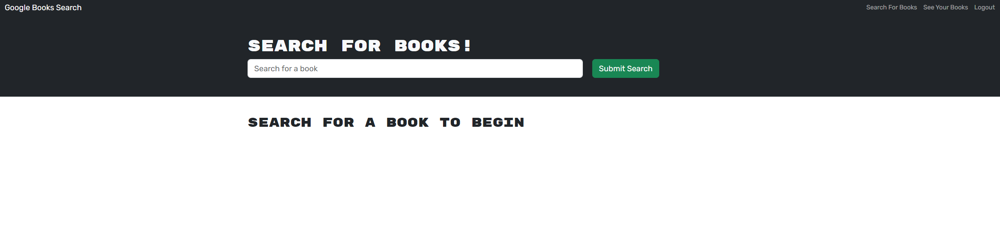

# Book Search Engine 

# Table of Contents
- [Description](#description)
- [Installation](#installation)
- [Usage](#usage)
- [License](#license)
- [Contribution](#contribution)
- [Tests](#test)
- [Questions](#questions)

## Description:
This application is a search engine for books, which allows you to search for books and add/delete them to or from your personal library, which is accessible after you create an account.

## Installation:

You can either install this application and run it on your local host (explained below), or you are able to use it via Heroku: https://p-h-davies-text-editor-5135231fbfde.herokuapp.com/

To install this application and run it on your local host, you will need to:
- Ensure you have a Terminator emulator Software installed (such as Terminal for Mac, or Bash for Windows). 
- Ensure you have a code editor, such as VSCode.

## Usage:
**If you are just using this application on Heroku**
You can type keywords into the search field to start finding new books! 
For a more premium experience, you can create an account by pressing the login/sign up button on the top righthand corner of the app. Once you are logged in, books returned in searches will feature a button which you can press to save the book to your list. To view your list, you need to press the 'See your Books' button at the top of the page. When on this page, you'll be able to view your saved books and remove them from your saved list by clicking the delete button which appears under each book.

**If you are installing this application to run on your local host, you'll need to follow these instructions**:

After cloning this code, you will need to navigate to the folder in your chosen terminal application and run two commands:
- npm run install
- npm run build
- npm run develop

After this, a port will open, and you'll be able to use the application by navigating to http://localhost:3002/ in your browser. 

Once you've arrived at the application on a browser, you can utilise the application as explained the Heroku section above.

## License:
The license for this project is: No_License.
This project has not been listed under a license.

## Contribution:
N/A

## Test:
N/A

## Questions
My GitHub username is p-h-davies, and you can view my profile here: https://github.com/p-h-davies/.
 
To get in contact with me, please email me here: philippadavies603@gmail.com.

